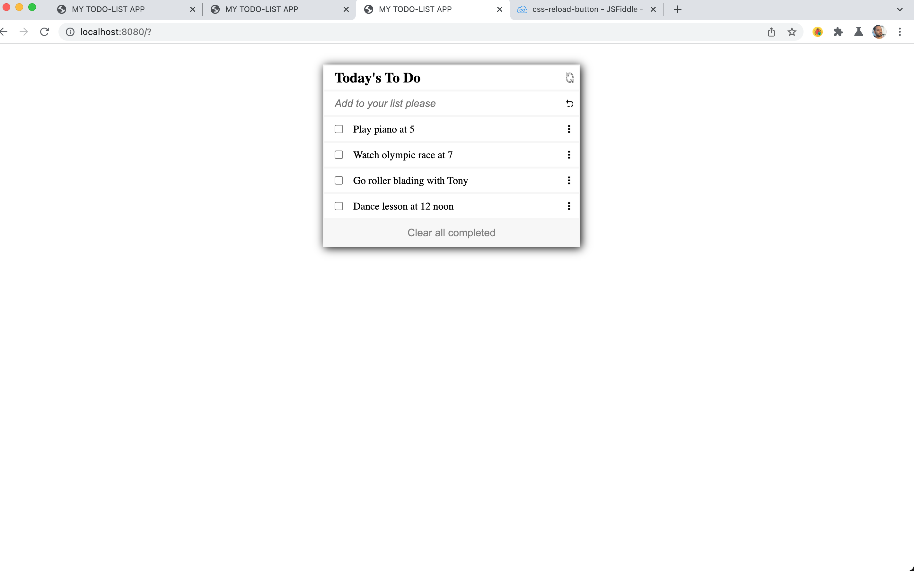

# TODO-LIST

> To Do List Application
> Organize your tasks with simple add and delete functionality. Organize your items with ease.

Additional description about the project and its features.

# Screenshots

## Built With

- HTML | CSS | JavaScript

## Getting Started

To get a local copy up and running follow these simple example steps.

### Prerequisites
- Text Editor | Git and Github set up

### Setup
- Clone repository and open with text editor

### Dependencies
- Run npm install - to load necessary files from package.json

### Linter Setup
- Apply Linter checks with the following instructions
* Webhint: Initialize and create `package.json` with `npm init -y`.

 After run `npm install --save-dev hint@6.x`
 Create a `.hintrc` file and then run `npx hint .` to check for errors.

* Stylelint: Next install stylelint for clean Styles and elimination of related errors.
 Run:`npm install --save-dev stylelint@13.x stylelint-scss@3.x stylelint-config-standard@21.x stylelint-csstree-validator@1.x`
 Afterwards create a `.stylelintrc.json` file and then run `npx stylelint "**/*.{css,scss}"` to check errors. Use `npx stylelint "**/*.{css,scss}" --fix` to fix multiple errors.

* Eslint: To find and fix script errors, run `npm install --save-dev eslint@7.x eslint-config-airbnb-base@14.x eslint-plugin-import@2.x babel-eslint@10.x`
After, create a `.eslintrc.json` file.
Then run `npx eslint .` to print errors. 
Use `npx eslint . --fix` to fix multiple errors.

### Usage
- View APP 
- Add list items
- Remove list items
- Re-order list items
- Reload (clear) list

## Author

👤 **STEVE W DAMES JR**

- GitHub: [@githubhandle](https://github.com/steveWDamesJr)
- Twitter: [@twitterhandle](https://twitter.com/Steve88312331)
- LinkedIn: [LinkedIn](https://www.linkedin.com/in/steve-w-dames-jr/)

## 🤝 Contributing

Contributions, issues, and feature requests are welcome!

Feel free to check the [issues page](../../issues/).

## Show your support

Give a ⭐️ if you like this project!

## Acknowledgments
- Based on a design by: Matt Shwery; Support on Twitter: [@twitterhandle](https://web.archive.org/web/20180320194056/http://twitter.com/mshwery)
- Hat tip to anyone whose code was used
- etc

## 📝 License

This project is [MIT](./MIT.md) licensed.
